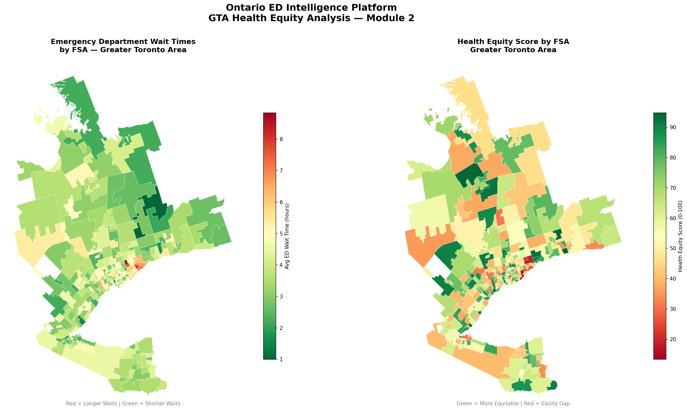
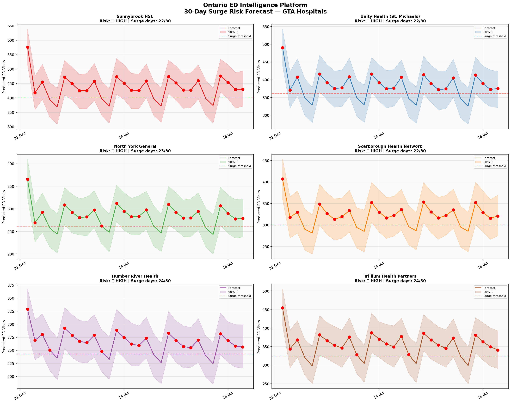
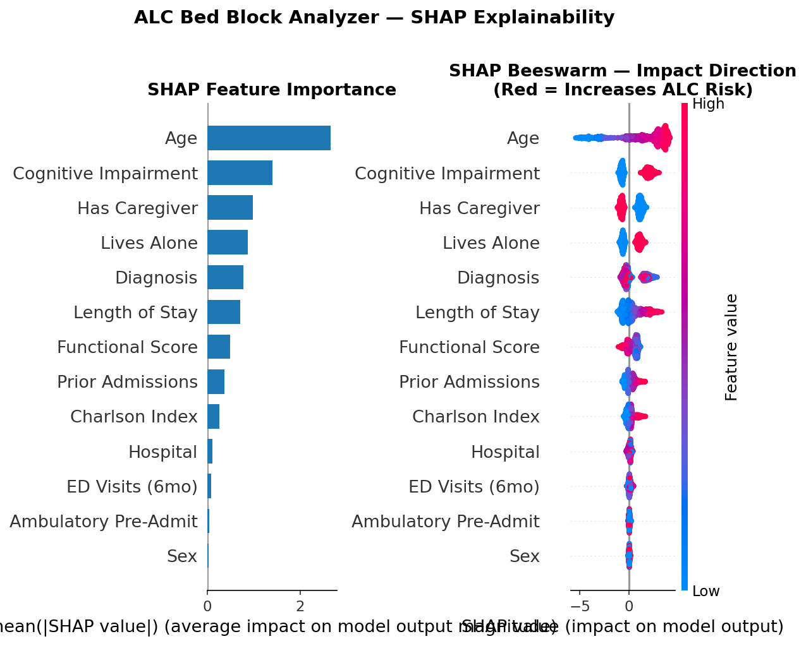
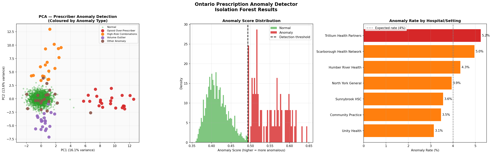
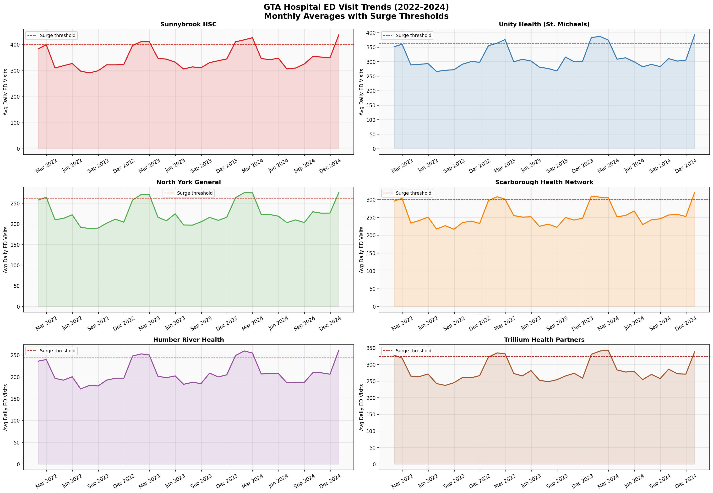
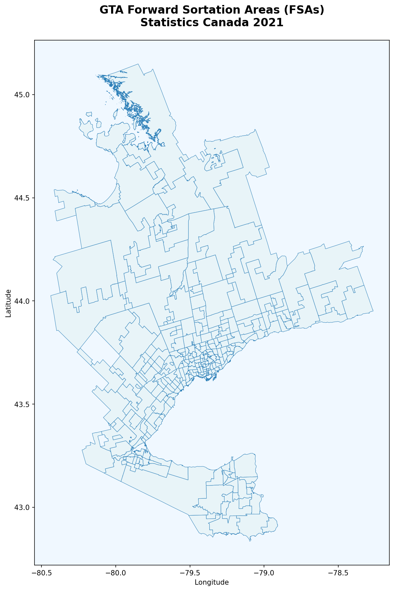
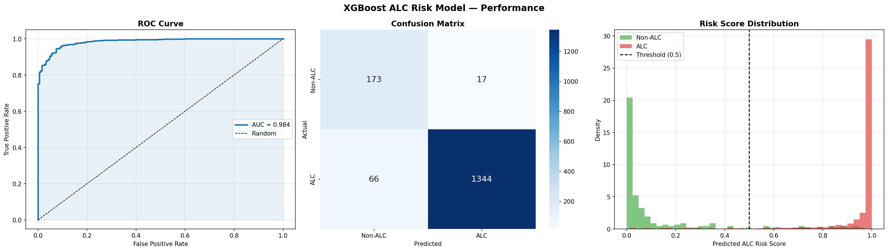
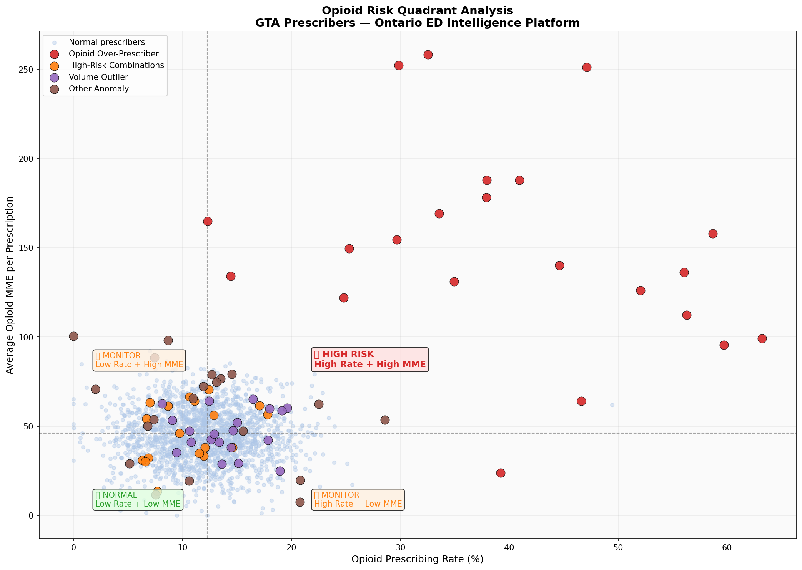

# 🏥 Ontario ED Intelligence Platform

> **AI-powered emergency department analytics for Ontario hospitals**
> Surge forecasting · Health equity mapping · ALC bed block detection · Prescription anomaly detection

---

## 🎯 Project Overview

Ontario's emergency departments face a systemic capacity crisis.
This platform gives hospital operations teams and Ontario Health planners
**actionable, explainable AI** - not black-box predictions.

| Problem | This Platform's Answer |
|---------|----------------------|
| Which hospitals will surge this week? | Prophet time-series forecast - 7 to 30 day horizon |
| Which neighbourhoods have the worst ED access? | GeoPandas FSA equity heatmap - 260 GTA zones |
| Which patients are blocking acute beds? | XGBoost + SHAP ALC classifier - AUC 0.984 |
| Which prescribers have abnormal opioid patterns? | Isolation Forest anomaly detector - 81.2% precision |

---

## 📸 Screenshots

| GTA Health Equity Heatmap | ED Surge Dashboard |
|---|---|
|  |  |

| ALC SHAP Explainability | Rx Anomaly Detection |
|---|---|
|  |  |

---

## 📊 Modules

### Module 1 - ED Surge Forecaster
> Which hospitals will be over capacity in the next 7 days?

- **Model:** Facebook Prophet with Ontario statutory holiday regressors
- **Hospitals:** Sunnybrook HSC, Unity Health, North York General, Scarborough Health Network, Humber River Health, Trillium Health Partners
- **Result:** 137 surge days predicted across 6 hospitals in 30-day horizon

---

### Module 2 - GTA Health Equity Heatmap
> Which neighbourhoods have the worst ED access and health outcomes?

- **Data:** Statistics Canada FSA Boundaries 2021 - real geographic shapefile
- **Coverage:** 260 Forward Sortation Areas across Greater Toronto Area
- **Result:** Scarborough (M1W, M1N) confirmed as highest-need zones

---

### Module 3 - ALC Bed Block Analyzer
> Which patients are blocking acute beds and need discharge planning today?

- **Model:** XGBoost binary classifier with SHAP explainability
- **ROC-AUC:** 0.984 | **Average Precision:** 0.998
- **Result:** 333 beds blocked across 6 hospitals

Top 5 ALC risk factors by SHAP:
1. Age - 2.6561
2. Cognitive Impairment - 1.4064
3. Has Caregiver - 0.9888
4. Lives Alone - 0.8703
5. Diagnosis - 0.7848

---

### Module 4 - Prescription Anomaly Detector
> Which prescribers have unusual opioid or polypharmacy patterns?

- **Model:** Isolation Forest unsupervised anomaly detection
- **Coverage:** 2,000 prescribers across GTA hospitals and community settings
- **Precision:** 0.812 | **Recall:** 0.812

Anomaly breakdown:
- Opioid over-prescribers: 22 (27.5%)
- Volume outliers: 20 (25.0%)
- High-risk combinations: 18 (22.5%)
- Other anomalies: 20 (25.0%)

---

## 📈 Key Results Summary

| Module | Model | Key Metric | Result |
|--------|-------|------------|--------|
| ED Surge Forecaster | Facebook Prophet | Surge days (30-day) | **137 across 6 hospitals** |
| Health Equity Heatmap | GeoPandas + Folium | FSAs analysed | **260 GTA zones** |
| ALC Bed Block Analyzer | XGBoost + SHAP | ROC-AUC | **0.984** |
| ALC Bed Block Analyzer | XGBoost + SHAP | Beds blocked | **333 across 6 hospitals** |
| Rx Anomaly Detector | Isolation Forest | Precision / Recall | **0.812 / 0.812** |
| Rx Anomaly Detector | Isolation Forest | Flagged prescribers | **80 of 2,000** |

---

## 🛠 Tech Stack

| Category | Tools |
|----------|-------|
| Languages | Python 3.10 |
| ML / Forecasting | XGBoost, Facebook Prophet, Isolation Forest, scikit-learn |
| Explainability | SHAP TreeExplainer |
| Geospatial | GeoPandas, Folium, Shapely |
| Visualization | Matplotlib, Seaborn, Plotly |
| Data Sources | Statistics Canada FSA 2021, Ontario Health open data |
| Infrastructure | Docker, GitHub Actions CI/CD |

---

## 📁 Repository Structure

    ontario-ed-intelligence/
    +-- .github/workflows/ci.yml
    +-- data/
    |   +-- raw/
    |   +-- processed/
    |       +-- surge_risk_summary.csv
    |       +-- rx_audit_list.csv
    +-- notebooks/
    |   +-- 01_EDA_Ontario_ED.ipynb
    |   +-- 02_ED_Surge_Forecaster.ipynb
    |   +-- 03_ALC_Bed_Block_Analyzer.ipynb
    |   +-- 04_Rx_Anomaly_Detector.ipynb
    +-- reports/
    +-- tests/
    +-- Dockerfile
    +-- requirements.txt
    +-- README.md

---

## 🚀 Quick Start

    git clone https://github.com/Aswinab97/ontario-ed-intelligence.git
    cd ontario-ed-intelligence
    python -m venv venv
    source venv/bin/activate
    pip install -r requirements.txt
    jupyter notebook

---

## 🏥 Ontario Health Context

| Priority | How This Platform Helps |
|----------|------------------------|
| **ED Overcrowding** | Surge forecasting enables proactive staffing and diversion decisions 7 days ahead |
| **Health Equity** | FSA-level mapping identifies underserved Scarborough communities for targeted investment |
| **ALC / LTC Pipeline** | Early ALC flag at admission enables same-day discharge planning and reduces hallway medicine |
| **Opioid Crisis** | Prescriber anomaly detection surfaces outliers for CPSO audit prioritization |

---

## ⚠️ Data Disclaimer

All patient, prescriber, and ED visit data is **synthetically generated**.
No real patient data or personal health information (PHI) is used.
Synthetic data is modelled on publicly available Ontario Health and Statistics Canada reports.

Real data integration points for production:
- NACRS for ED visit data
- Ontario Drug Benefit (ODB) database for prescribing patterns
- CIHI Discharge Abstract Database for ALC and LOS data
- Statistics Canada FSA boundaries (already integrated - real shapefile)

---

## 👤 Author

**Aswin** - Health Data Scientist
- 📍 Ontario, Canada
- 🔗 [GitHub](https://github.com/Aswinab97)

---

## 📄 License

MIT License

*Data sources: Statistics Canada Open Government Licence, Ontario Health open data*
