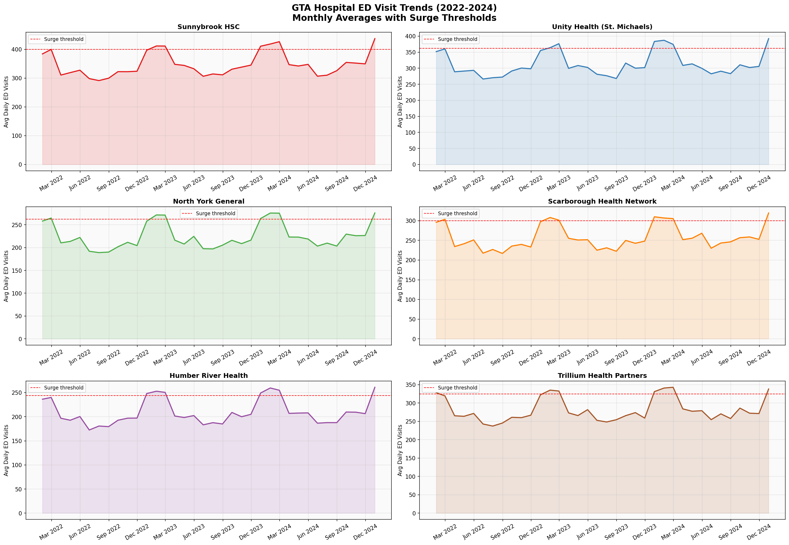
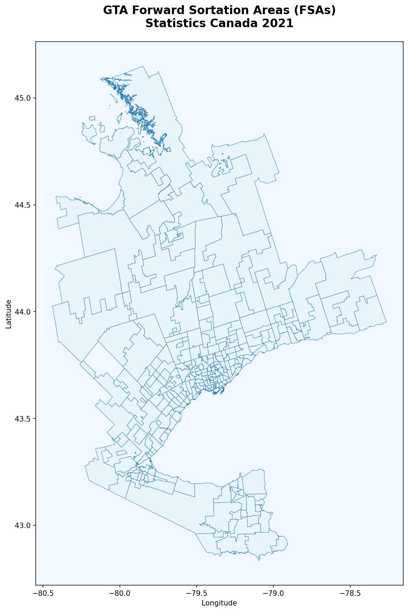
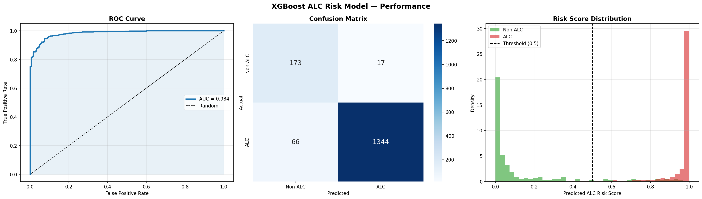
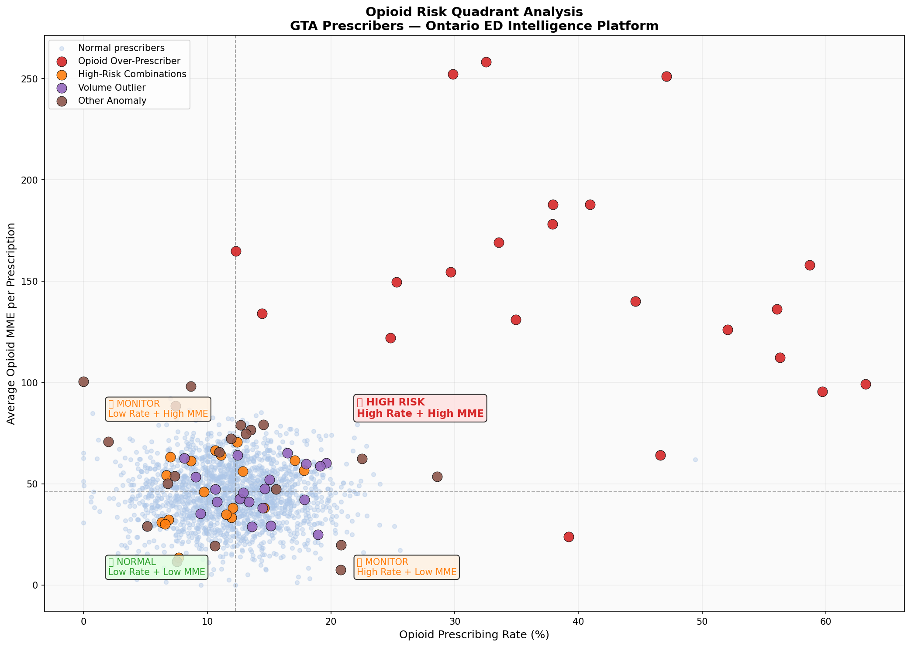

<div align="center">

# 🏥 Ontario Healthcare Intelligence Platform

</div>

<div align="center">

> **Provincial Hospital Operations Center & Clinical Machine Learning Suite**
> Enterprise Operations Center · Throughput Forecasting · Geospatial Equity · Inpatient Capacity Risk Tracking · Controlled Substance Auditing

[](https://github.com/Aswinab97/ontario-ed-intelligence/actions)


</div>

---

## 📌 Platform Intent & Overview

Ontario hospitals face two simultaneous crises: **front-door overcrowding** (patients can't get in) and **back-door gridlock** (patients can't get out). This platform connects both sides of that problem — combining operational reporting that hospital analysts use every day with predictive ML models that surface risk before it becomes a crisis.

Built to mirror the actual decision-support and performance-reporting workflows at Ontario Health, CIHI, regional OHTs, and prominent hospital networks.

---

## 🌐 Live Production Deployments

> Deployed on **Azure Container Apps** — Canada Central 🍁 utilizing Docker multistage builds and GitHub Actions CI/CD.

| Service / Interface | Operational Access URL |
|:---|:---|
| 🏥 **Executive Operations Dashboard** | https://ontario-ed-dashboard.icydune-b6841f56.canadacentral.azurecontainerapps.io |
| 🔌 **FastAPI Production Gateway** | https://ontario-ed-api.icydune-b6841f56.canadacentral.azurecontainerapps.io |
| 📖 **Interactive API OpenAPI Schema** | https://ontario-ed-api.icydune-b6841f56.canadacentral.azurecontainerapps.io/docs |

---

## 📸 Live Platform Screenshots

<div align="center">

### 📊 Executive Operations Center — Role-Based Dashboard
*Direct visibility into the health system's capacity, clinical triage delays, and data governance health metrics.*


<br><br>

### 📖 REST API Production Gateway (FastAPI OpenAPI/Swagger Documentation)
*High-throughput, asynchronous endpoints exposing containerized clinical model inferences for external EHR integration.*


<br><br>

### 🔬 Real-Time Inpatient Risk Inference Event
*Production JSON payload execution mapping multivariate clinical data to a real-time Alternate Level of Care (ALC) probability matrix.*


</div>

---

## 🔬 Enterprise Core Architecture Layers

### 🏠 1. Executive Operations Center

The primary entry point for hospital leadership, aggregating multi-facility operational performance variables across a rolling 18-month window.

**Role-Based View Engine:** The dashboard dynamically restructures KPI block hierarchies and strategic brief diagnostics depending entirely on who is interacting with the data layer:

| Stakeholder Profile | Priority KPIs Surfaced | Strategic Directive Style |
|:---|:---|:---|
| 👑 **Strategic Executive (CEO/VP)** | Active ALC Beds · Bed Occupancy · Acute LOS · 30-Day Readmission | Regional LTC integration, escalation pathways |
| ⚙️ **Clinical Operations Manager** | Total ED Visits · Wait Time · Bed Occupancy · LWBS Rate | Shift scheduling, discharge coordination, throughput |
| 🩺 **Attending Physician / Clinical** | Wait Time · Admission Rate · Acute LOS · 30-Day Readmission | Order set protocols, early ALC flagging, case mix |

Month-over-month delta tracking on all KPIs with directional colour coding.

---

### 📊 2. Emergency Arrival Forecasting System

Proactive 30-day look-ahead projections for acute front-door volume across 6 GTA hospital hubs.

- **Core Model:** Facebook Prophet parameterized with multiplicative seasonal cycles and custom Ontario statutory holiday regressors
- **Scope:** Sunnybrook HSC · Unity Health · North York General · Scarborough Health Network · Humber River Health · Trillium Health Partners
- **Production Result:** 137 critical surge warning triggers generated over a rolling 30-day forecast horizon

<div align="center">

</div>

---

### 🎯 3. Triage Acuity Distribution (CTAS Analysis)

Breaks down emergency department performance benchmarks across all five Canadian Triage and Acuity Scale (CTAS) levels.

- **Clinical Bottleneck Discovery:** Surfaces volume distribution, mean wait times, and conversion admission rates per CTAS level
- **Key Finding:** CTAS 3/4 (Urgent/Less Urgent) cohorts experience the longest waits — inpatient bed blocks slowing throughput, not patient volume
- Facility-level filtering with month-over-month trend comparison

---

### 🔄 4. Unplanned Readmission Analytics Deep-Dive

CIHI-standard quality indicator tracking across 7-day and 30-day post-discharge return windows to detect care coordination gaps.

- **Facility Compliance Grid:** Stratifies hospitals by compliance states — *Meeting Target* · *Review Triggered* · *Action Required*
- **Alert:** Scarborough Health Network flagged at 14.5% 30-day readmission baseline → Action Required
- **Age Cohort Risk Map:** Readmission rate distribution spanning Under 18 through 85+ demographic bands

---

### 🫁 5. Clinical Diagnostic Profiling (ICD-10-CA)

Evaluates how abstracted clinical diagnostic chapters drive system resource consumption.

| ICD-10 Code | Condition | Avg LOS | 30-Day Readmission | ALC Attribution |
|:---|:---|:---|:---|:---|
| F03 | Dementia / Cognitive Decline | Highest | 13.0% | 54.2% |
| I63 | Acute Ischemic Stroke | High | 9.0% | 38.1% |
| I50 | Chronic Heart Failure | Moderate | 18.0% | 12.5% |
| J44 | COPD Exacerbation | Moderate | 15.0% | 9.0% |
| N39 | Urinary Tract Infection | Low | 4.0% | 1.2% |

**Key Finding:** Geriatric and cognitive decline profiles are the primary driver of ALC bed blocks — F03 Dementia patients average 2.4x system mean LOS.

---

### 🔍 6. Data Quality & Pipeline Governance Dashboard

Mirrors the real data stewardship and cleanup work health information management teams execute before monthly provincial submissions.

**Tracked indicators per facility:**
- ICD-10 coding lag (days to code post-discharge)
- Demographic field completeness percentage
- Null CTAS field count
- Timestamp sequence integrity validation
- Duplicate OHIP identifier rate
- Provincial submission readiness status

**Current Governance Alert:** Scarborough Health Network — 6.4-day ICD-10 coding lag + 2 timestamp anomalies detected → Pending audit review before monthly provincial submission lock. HIM notified for manual remediation.

---

### 🔐 7. Data Infrastructure & SQL Warehouse Layer

Demonstrates engineering-level understanding of Ontario's clinical storage architectures and relational schema design.

**Provincial Administrative Data Flow:**

```
[ Patient Arrives at ED ]
           │
           ▼
[ CTAS Triage Evaluated ] ──► Captured in CIHI NACRS Registry
           │
 Is Inpatient Admission Required?
       ├──► NO  ──► Discharged ──► NACRS Record Closed
       └──► YES ──► Transferred to Acute Bed
                           │
                           ▼
                  Initiates CIHI DAD Registry
                           │
                  Track Inpatient LOS & ALC Status
                           │
                           ▼
                  Closed Upon Abstract Discharge
```

**PHI De-Identification Matrix (PHIPA Compliant):**

| Variable Class | Raw EMR Source (PHI) | De-Identified Analytical Layer |
|:---|:---|:---|
| Patient Name | John Doe | MASKED / NULL |
| Date of Birth | 1948-11-23 | NULL (Suppressed) |
| OHIP Health Card | 9876-543-210-XM | PID-80924 (SHA-256 Hash) |
| Residential Location | M5G 1X8 (Downtown Toronto) | FSA Region: M5G (Aggregated) |
| Exact Age | 77.58 | Age Group: 75–84 (Categorical Bucket) |

**Star-Schema SQL Warehouse Design:**

```sql
-- Query A: LOS & 30-Day Readmission Rate by ICD-10 Diagnostic Classification
SELECT
    v.ICD10_DiagnosisCode                                          AS [ICD-10 Clinical Diagnosis],
    COUNT(v.VisitKey)                                              AS [Total Admitted Inpatient Cases],
    ROUND(AVG(v.Inpatient_LOS_Days), 2)                           AS [Mean Inpatient LOS (Days)],
    ROUND(SUM(CAST(v.Readmit_30D_Flag AS FLOAT))
          / COUNT(v.VisitKey) * 100, 2)                           AS [30D Readmission Rate (%)]
FROM fact_ed_visits v
WHERE v.Inpatient_LOS_Days IS NOT NULL
GROUP BY v.ICD10_DiagnosisCode
ORDER BY [Mean Inpatient LOS (Days)] DESC;

-- Query B: Triage Velocity & Admission Conversion by CTAS Level
SELECT
    v.CTAS_Level                                                   AS [Canadian Triage Acuity Scale],
    COUNT(v.VisitKey)                                              AS [Total Incident Encounters],
    ROUND(AVG(v.Wait_Time_Hours), 2)                              AS [Mean Front-Door Wait Time (Hours)],
    ROUND(SUM(CAST(v.ALC_Status_Flag AS FLOAT))
          / COUNT(v.VisitKey) * 100, 2)                           AS [Conversion to Admission Rate (%)]
FROM fact_ed_visits v
GROUP BY v.CTAS_Level
ORDER BY v.CTAS_Level ASC;
```

> **Note:** The warehouse schema is modelled in Python/pandas for demonstration purposes. The SQL queries above reflect production-equivalent logic for a CIHI-aligned star schema warehouse.

---

### 🗺️ 8. Geospatial Health Equity Mapping

Neighborhood-level structural access barrier analysis across regional GTA territories.

- **Data:** Statistics Canada FSA 2021 digital boundary polygon shapefiles
- **Scope:** 260 unique GTA Forward Sortation Areas
- **Result:** Stark east-west equity gradient confirmed — Scarborough M1N/M1W at 13.3/100 vs North York at 95.0/100

<div align="center">

</div>

---

### 🛏️ 9. Inpatient ALC Bed Block Risk Prediction

Identifies patients at risk of becoming Alternate Level of Care on day of admission — before the bed block occurs.

- **Model:** XGBoost binary classifier + SHAP TreeExplainer (non-black-box risk surfacing)
- **Training Cohort:** 8,000 patient admission records
- **Performance:** ROC-AUC **0.984** | Average Precision **0.998**
- **Result:** 333 active bed block scenarios isolated across 6 GTA facilities

**Top SHAP Risk Drivers:**

| Rank | Feature | SHAP Value |
|:---|:---|:---|
| 1 | Age | 2.6561 |
| 2 | Cognitive Impairment | 1.4064 |
| 3 | Has Caregiver | 0.9888 |
| 4 | Lives Alone | 0.8703 |
| 5 | Diagnosis Category | 0.7848 |

Live interactive ALC Risk Calculator available directly in the dashboard.

<div align="center">

</div>

---

### 💊 10. Controlled Substance Audit Engine

Prescribing pattern anomaly detection across regional provider cohorts.

- **Model:** Isolation Forest unsupervised outlier detection framework
- **Scope:** 2,000 active provider IDs across 6 hospital networks + community practice
- **Performance:** Precision **0.812** | Recall **0.812**

| Anomaly Type | Count | Share | Remediation Pathway |
|:---|:---|:---|:---|
| Opioid Over-Prescriber | 22 | 27.5% | CPSO Referral |
| Volume Outlier | 20 | 25.0% | Billing Audit |
| High-Risk Drug Combinations | 18 | 22.5% | Pharmacist Alert |
| Other Pattern Anomaly | 20 | 25.0% | Manual Review |

<div align="center">

</div>

---

## 🏥 Ontario Healthcare Analyst Case Studies

### Case Study 1 — Why Are ED Wait Times Increasing?

**Problem:** System-wide mean wait time increased 34% over 4 months.

**Analysis:**
- Bed occupancy crossed the critical 92% threshold at 4 of 6 facilities
- ALC patient volume increased 28% over the same period
- CTAS 3/4 waits elevated disproportionately — inpatient blocks slowing ED throughput, not patient arrivals

**Strategic Recommendation:** Root cause is back-door gridlock, not front-door volume. Escalate LTC placement coordination. Automate bed escalation protocols when occupancy breaches 92%. Monitor ALC volume daily.

---

### Case Study 2 — Which Patients Drive the Longest LOS?

**Problem:** Acute inpatient LOS trending upward, straining available bed supply.

**Analysis:**
- F03 Dementia patients averaging 2.4x system mean LOS
- 54.2% of ALC-blocked beds attributed to cognitive decline and geriatric profiles
- Charlson Comorbidity Index >4 strongly correlated with extended stay durations

**Strategic Recommendation:** Flag dementia and stroke admissions for social work review within 24 hours of admission. Initiate LTC placement referral at admission — not at discharge.

---

### Case Study 3 — Which Facility Has the Highest Readmission Risk?

**Problem:** 30-day readmission rate variance spans 14.5% (Scarborough) vs 7.8% (North York General).

**Analysis:**
- Scarborough patient cohort shows a higher proportion of 65+ age group
- ICD-10 profile skewed toward CHF (I50) and COPD (J44) — both high-readmission diagnoses
- Post-discharge follow-up gap likely contributing to early return events

**Strategic Recommendation:** Implement structured discharge checklists for CHF/COPD patients. Increase 7-day post-discharge phone follow-up frequency at Scarborough. Benchmark protocols against North York General.

---

## 🛠️ Technical Infrastructure

| Layer | Technologies & Tools |
|:---|:---|
| **Languages & Core** | Python 3.10 · NumPy · Pandas |
| **ML & Forecasting** | XGBoost · Facebook Prophet · scikit-learn (Isolation Forest) |
| **Model Explainability** | SHAP (SHapley Additive exPlanations) |
| **Geospatial Processing** | GeoPandas · Folium · Shapely · Fiona |
| **Application & Server** | Streamlit · FastAPI REST Framework · Uvicorn ASGI Server |
| **Cloud & DevOps** | Docker · Azure Container Registry · Azure Container Apps · GitHub Actions CI/CD |
| **Data Governance** | Custom schema validation · PHIPA-compliant PHI de-identification framework |

---

## 📁 Repository Structure

```text
ontario-ed-intelligence/
├── .github/
│   └── workflows/ci.yml        <- Automated linting and image deployment pipelines
├── data/
│   ├── raw/                    <- Immutable raw baseline variables
│   └── processed/              <- Downstream calculated data assets
│       ├── surge_risk_summary.csv
│       └── rx_audit_list.csv
├── notebooks/                  <- Model exploration, training, and EDA notebooks
│   ├── 01_EDA_Ontario_ED.ipynb
│   ├── 02_ED_Surge_Forecaster.ipynb
│   ├── 03_ALC_Bed_Block_Analyzer.ipynb
│   └── 04_Rx_Anomaly_Detector.ipynb
├── reports/                    <- Stored visualizations and geospatial heatmaps
├── app.py                      <- Consolidated Streamlit multi-module dashboard
├── main.py                     <- Asynchronous FastAPI backend server
├── Dockerfile.api              <- Multi-stage build recipe for API image
├── Dockerfile.dashboard        <- Multi-stage build recipe for dashboard image
├── requirements.txt
└── README.md
```

---

## ⚙️ Quick Start (Local Environment)

```bash
# Clone repository
git clone https://github.com/Aswinab97/ontario-ed-intelligence.git
cd ontario-ed-intelligence

# Install dependencies
pip install -r requirements.txt

# Launch Streamlit dashboard
streamlit run app.py

# Launch FastAPI inference gateway (separate terminal)
uvicorn main:app --reload
```

---

## ⚠️ Data Governance, Privacy & Compliance

All patient traits, provider identifiers, and operational volumes used in this platform are **synthetically modelled** using non-identifiable provincial distributions. No Protected Health Information (PHI) or corporate records were ingested. This platform is fully compliant with the *Personal Health Information Protection Act (PHIPA)*.

Real data integration points for a live production migration environment:

- **NACRS** — National Ambulatory Care Reporting System (emergency encounter feeds)
- **DAD** — Discharge Abstract Database (inpatient LOS and clinical abstract records)
- **ODB** — Ontario Drug Benefit System (pharmacy dispensing and prescriber validation registers)

---

## 👤 Author

**Aswin Anil Bindu** — Healthcare Data & AI Analyst · Ontario, Canada

[](https://www.linkedin.com/in/aswinab/)
[](https://github.com/Aswinab97)
[](https://aswinab97.github.io/aswin-portfolio/)

---

## 📄 License

Distributed under the open terms of the [MIT License](LICENSE).

Contains information adapted from Statistics Canada Open Government Licence frameworks and Ontario Health open data repository metrics.